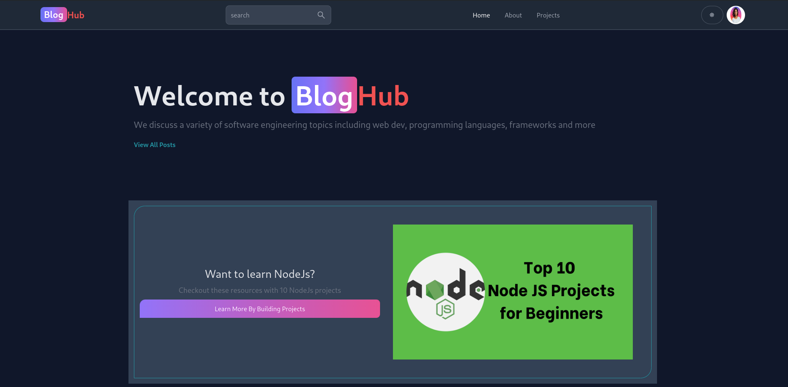
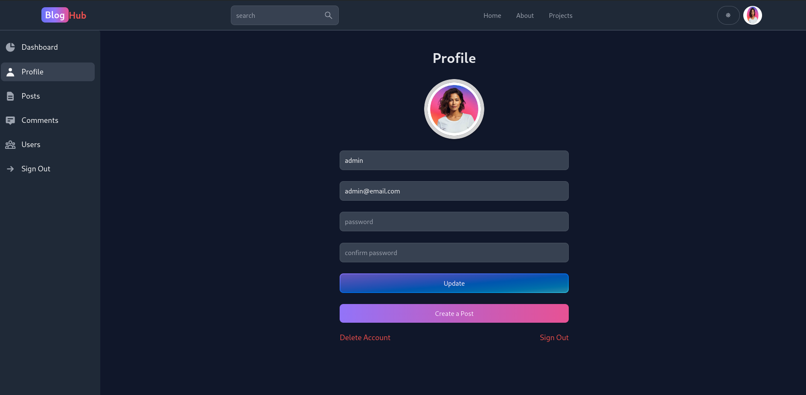
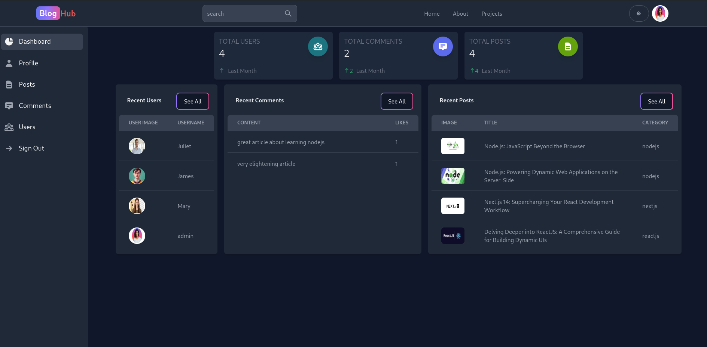
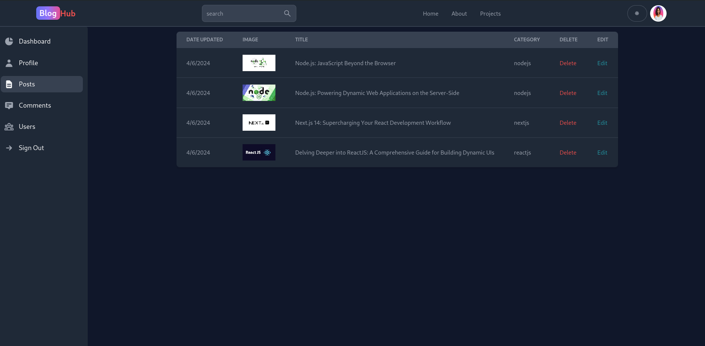
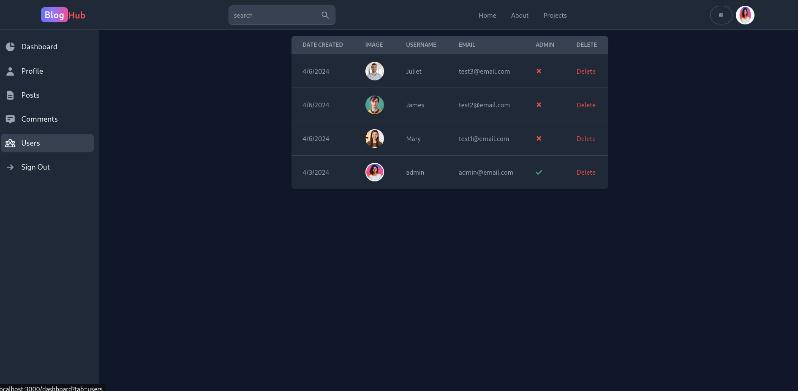
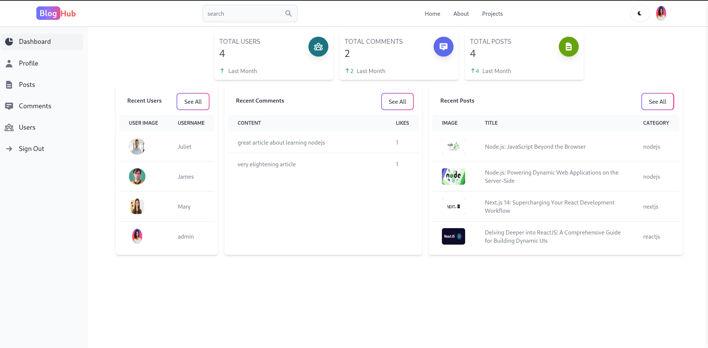
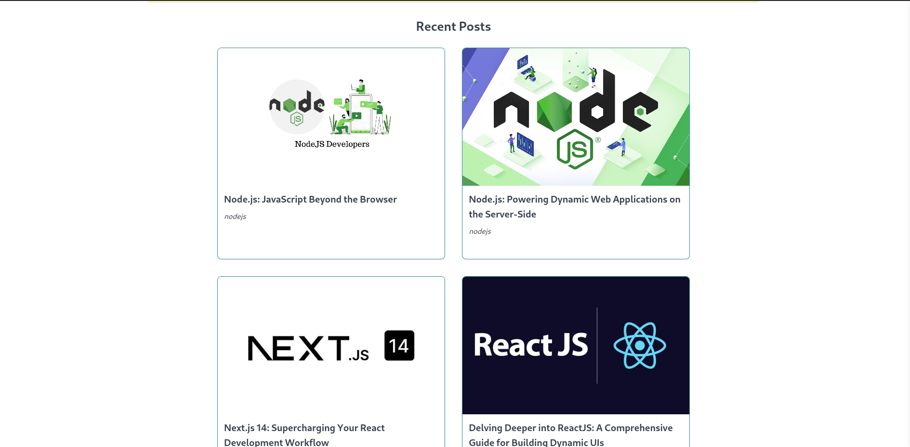

- blog application made with MERN stack
  Features:
- rich text editor
- blog articles page display
- commenting on articles
- liking articles
- light and dark themes
- Intuitive dashboard
- easy navigation
- search functionality
- article categorization
- mobile responsive
- and much more

Tech stacks

- React
- NodeJs/Express
- MongoDB
- Redux Toolkit

Screenshots

